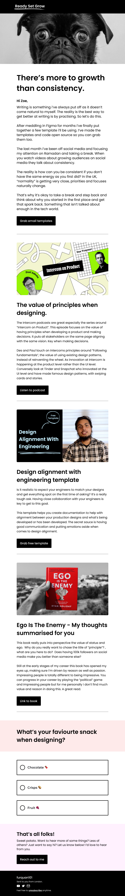

 <h1>Programa de Formação - Desenvolve 2023</h1>
 <h2>Email Templates<h2>

---

## 💻 Sobre o Projeto

Este projeto consiste em uma aplicação web responsiva desenvolvida durante a etapa de de aprendizagem do Programa de Formação - Desenvolve 2023.
O <strong>Email Templates</strong> é um projeto criado no Desafio 01, que tem como objetivo Desenvolver templates de E-mail usando HTML e CSS a partir de um template no protótipo do figma, idealizada no ambito educacional, para o processo de aprendizagem das tecnologias envolvidas.

---

## ✅ Demonstração da aplicação

### 📱 Mobile

<h1 align="center">
  
</h1>

---

## 🛠️ Tecnologias Utilizadas

---

## ⚙️ Executando o projeto localmente (Linux ou Windows)

### Pré-requisitos

- Ter um navegador web instalado.
- Git.

### Instalação e execução

- Clone o repositório em um diretório de sua preferência
         
      git clone https://github.com/gleisonfernandes/EmailTemplates.git

- Abra o diretório do projeto
- Execute o arquivo index.html com o navegador.

---

## 🚀 Estudante

|_Gleison Fernandes_|
|---|
||
|_Desenvolvedor_|
|    |